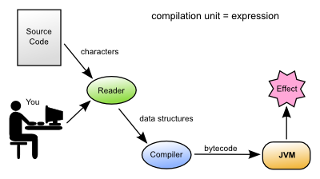

# Clojure nedir?

**Clojure**, **Lisp** diyalekti olup fonksiyonel bir programlama dilidir. **JVM** (_JAVA Virtual Machine_) tabanlı uygulamalar geliştirebilir ayrıca **Clojure-Script** ile **Web** tabanlı uygulamalar oluşturabilirsiniz. Clojure'un güzel özelliklerinde biri de JVM tabanlı olduğu için **JAVA** kütüphanelerine erişim imkânı sağlıyor. Bu sayede zengin bir geliştirme havuzu karşılıyor bizleri.


### Neden fonksiyonel programlama?

Nesne yönelimli programlama dilleri (_JAVA_) anlaşılması kolay ve uygulanabilir olarak görünüyor. OOP gerçek dünyayı sanal dünya ile ilişkilendirip anlaşılması kolay bir yapı sunuyor bizlere fakat gerçekten de anlaşılması kolay bir yapımı sunuyor yoksa daha fazla karmaşık bir halemi getiriyor. Fonksiyonel programlamanın temelinde yatan şey de her şeyin temeli olan _Matematik_'le ifade edilebilir. Bir programın girdileri ve çıktıları olur aynı matematikteki fonksiyonlar gibi.


Yukarıda görmüş olduğumuz ifade hepimizin bir şekilde karşılaştığı bir görseldir. Görselde ki ifadeyi clojure ile yazalım.

```clojure
(defn f [x] (+ (* 2 x) 1))
```

Fonksiyonu _clojure_ ile yazdık ve gördük ki ne kadar da kolaymış aslında. Fonksiyonel bir programlama dilinde geliştirilen code en küçük fonksiyonlardan en büyük fonksiyonlara doğrudur. Betimlemek istersek, _obeb_ alan bir fonksiyon yazarız ve bunu daha büyük bir fonksiyonda kullanırız.

Clojure dilinin getirileri arasında benim en çok sevdiğim ve hayatımı kolaylaştıran bir özelliği de veri manipülasyonunun çok kolay ve anlaşılır bir ifadeyle ortaya koymasıdır. Basit bir örnek vermek gerekirse. Bir dizi içerisinde çift sayıları filtreleyelim.

```clojure
(filter even? [1 2 3 4 5 6]) ; => (2 4 6)
```

Neden fonksiyonel programlama dediğimizde örnekleri bu şekilde çoğaltabiliriz.

### Clojure'a giriş

**Sayısal Türler**

```clojure
42        ; integer
-1.5      ; floating point
22/7      ; ratio
```

**Karakter Türleri**

```clojure
"hello"   ; string
\e        ; character
#"[0-9]+" ; regular expression
```

**Koleksiyon Türleri**

```clojure
'(1 2 3)     ; list
[1 2 3]      ; vector
#{1 2 3}     ; set
{:a 1, :b 2} ; map
```

### Clojure ifade değerlendirmesi



Clojure kaynak code okuyucu (Reader) tarafından okunur. Okuyucu, kaynağı (_.clj_) uzantılı dosyalardan okuyabilir. Okuyucu clojure verilerini üretir. Clojure derleyicisi _JVM_ için byte code üretir.

Basit bir şekilde clojure nedir? Neden fonksiyonel programlama? ve clojure küçük bir giriş yaptık. Bundan sonraki yazılarda clojure ile API, Web, mobil ve masaüstü programlar nasıl geliştirilir bunları paylaşacağım.

```clojure
(defn bye [your-name]
  (str "Hoşçakal " your-name))
```

