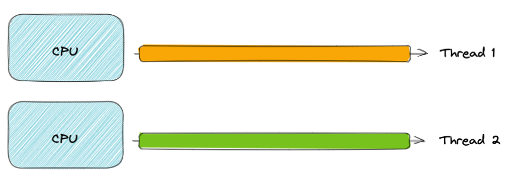

- **Rob Pike**, **Robert Griesemer** ve **Ken Thompson** tarafından tasarlanmis.
- Açık kaynak kodlu ve ``statik`` tipli bir programlama dilidir.
- 25 anahtar Sözcük (keyword)
- Derlenen bir dildir.

##### Thread (Tek CPU Kernel)


##### Thread (Multi CPU kernel)



### Goroutine

- Light-weight threads olarak geçer.
- İşletim sistemi threadlerinden daha ucuzlardır. Stack boyutları threadlere göre daha düşüktür. Goroutinlerin boyutu 2KB'dır.
- Go runtime tarafından yönetilir. (User thread gibi)
- Therad'e göre daha az maliyetlidir. Context switch yaparken.
- Channellar ile haberleşirler.
- Kendi stack boyutlarını runtime'da küçültebilir aynı zamanda büyültebilirler.
- Goroutineler işletim sistemi threadleri üzerinde çalışır(kernel).
- Main goroutine default.
- Goroutineler stack boyutlarını 64-bit'deki işlemcilerde 1GB kadar 32-bit'lerde 250MB kadar max büyütebilir. ``runtime.morestack`` daha fazla stack ihtiyacı varsa bu komut çalıştırılır.

### Go Scheduler

- GMP
- Go runtime'a özeldir.
- Birden fazla goroutine birden fazla thread üzerinde çalışabilir.``schema-1``
- Görevi çalıştırmaya hazır goroutineleri threadler üzerinde çalıştırmaktır.(kernel thread).
- Bir işletim sistemi thread'i mutlaka bir processor'e bağlı olmak zorundadır. Yoksa goroutinler o thread üzerinde çalışamaz.
- Go runtime'ın bir parçasıdır. Go scheduler user seviyesinde çalışan yapılardır.


``schema-1``

```go
func main() {
	fmt.Println("Hello World!")
}
```

Bu code çalışınca neler olur? Go scheduler nasıl haraket eder?


- Runtime bir processor yaratıyor. (P)
- Scheduler initialize oluyor ve bir işletim sistemi thread'i yaratıyor.
- ``runtime.main``  çağırılıyor. Aslında main.main çağırılıyor. bizim main fonksiyonumuzu çağırır.
- Bu bir main goroutine oluşturur.
- P nin local queue'suna ekliyor. P'nin içerisinde bir goroutine sırası var ve main goroutine oraya pushlanıyor.
- İşletim sistemi thread'imiz processor'e bağlanıyor. P'nin içerisindeki goroutine'ni çalıştırmak için gerekli bigileri alıyor.
- Goroutine işletim sistemi thread'ine bağlanıyor.
- İşlemini gerçekleştiriyor. Code çalışır ve bitiyor her hangi bir duruma bağlı olarak (exit, panic, defer). sonrasında ``runtime.exit`` çağırılıyor.
