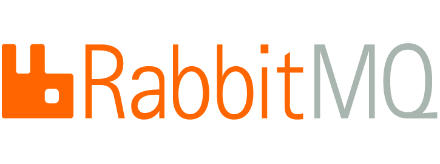

Message queuing systems have revolutionized the way modern applications communicate and handle data. Two prominent players in the message queue landscape are RabbitMQ and Kafka. In this article, we will explore the features, advantages, and disadvantages of both systems to help you make an informed decision when choosing the right one for your project.

## RabbitMQ

RabbitMQ is an open-source message broker that implements the Advanced Message Queuing Protocol (AMQP). It provides a robust and flexible messaging solution, making it a popular choice for various applications.

RabbitMQ boasts the following key features:

- **Ease of Use:** RabbitMQ's straightforward integration and support for multiple client libraries make it accessible to developers using different programming languages.

- **Message Reliability:** One of RabbitMQ's strengths is its focus on message reliability. It ensures that messages are delivered to their intended recipients even in the face of network failures and intermittent connection issues.

- **Exchange Types:** RabbitMQ supports various exchange types, including direct, topic, fanout, and headers, allowing different communication patterns between producers and consumers.

- **Message Acknowledgment:** RabbitMQ allows consumers to acknowledge the receipt of messages, ensuring that messages are not lost in case of consumer failure.

- **Management Console:** RabbitMQ comes with a user-friendly management console, providing real-time insights into queues, exchanges, and bindings, making it easier to monitor and manage the message flow.

## Kafka

Kafka, developed by LinkedIn and later open-sourced by the Apache Software Foundation, is a distributed streaming platform designed to handle real-time data feeds and stream processing.

Kafka's key features include:

- **Scalability:** Kafka is designed to be highly scalable and can handle large volumes of data and high message throughput. Its distributed architecture enables seamless horizontal scaling as data size and load increase.

- **Durability:** Kafka stores messages on disk, providing durability even in the event of system failures. This feature makes it an excellent choice for applications that require long-term data retention.

- **Real-time Data Streaming:** Kafka's ability to process real-time data streams makes it ideal for scenarios like real-time analytics, log processing, and event-driven architectures.

- **Partitioning:** Kafka partitions data across multiple nodes in a cluster, enabling parallel processing and efficient data distribution.

- **Exactly-Once Semantics:** Kafka provides strong message delivery guarantees, ensuring that messages are delivered once and only once to consumers.

## Cons

### RabbitMQ:

- **Performance:** While RabbitMQ is efficient for moderate workloads, its performance might degrade under heavy loads and high message throughput compared to Kafka.

- **Complex Event Processing:** RabbitMQ is not designed for complex event processing, which might limit its usability for certain use cases.

### Kafka:

- **Learning Curve:** Kafka's initial setup and configuration can be more complex compared to RabbitMQ, which might require more time and effort for beginners.

- **Resource Consumption:** Kafka's disk storage requirements and memory consumption can be relatively higher, especially when dealing with large volumes of data.

## Pros

### RabbitMQ:

- **Ease of Use:** As mentioned earlier, RabbitMQ's straightforward integration makes it an excellent choice for developers of varying expertise.

- **Message Reliability:** The focus on message reliability ensures that messages are delivered without loss or duplication.

- **Exchange Flexibility:** RabbitMQ's support for various exchange types allows developers to implement a wide range of messaging patterns.

### Kafka:

- **Scalability:** Kafka's distributed architecture enables it to handle vast amounts of data and scale horizontally as needed.

- **Durability:** Kafka's ability to store messages on disk provides durability and fault tolerance, making it a reliable choice for critical applications.

- **Real-time Processing:** Kafka's support for real-time data streams is a significant advantage for applications requiring immediate data insights.

## Conclusion

In conclusion, both RabbitMQ and Kafka are powerful message queuing systems, each with its unique strengths and weaknesses. When choosing between the two, it's essential to consider your specific requirements and use case. RabbitMQ excels in ease of use and message reliability, making it a great choice for straightforward messaging needs. On the other hand, Kafka's scalability and real-time data processing capabilities make it ideal for scenarios that demand high throughput and fault-tolerance.

Ultimately, the decision between RabbitMQ and Kafka depends on your project's specific needs and constraints. Both systems have been proven in various scenarios and can significantly contribute to building a robust and efficient messaging infrastructure for your applications. As you make your choice, remember to evaluate factors such as performance, scalability, ease of use, and the complexity of your application's messaging requirements. Happy queuing!

> "Choose wisely, and your message queue will be the backbone of your distributed systems."