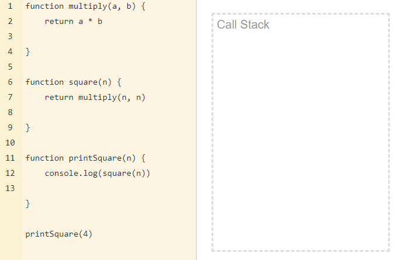

### Blocking and Non-Blocking with Node.JS

- **Blocking** methods execute synchronously and **non-blocking** methods execute asynchronously.
  - Example:
  
     ```javascript
      // This is a synchronous file read.
      const fs = require('fs');
      const data = fs.readFileSync('/file.md'); // blocks here until file is read
      ```

     ```javascript
      // This is a asynchronous
      const fs = require('fs');
      fs.readFile('/file.md', (err, data) => {
        if (err) throw err;
      });
      ```

     ```javascript
      const fs = require('fs');
      const data = fs.readFileSync('/file.md'); // blocks here until file is read
      console.log(data);
      moreWork(); // will run after console.log
      ```

     ```javascript
      const fs = require('fs');
      fs.readFile('/file.md', (err, data) => {
        if (err) throw err;
        console.log(data);
      });
      moreWork(); // will run before console.log
      ```
  
### Single Thread

- Javascript execution in Node.js is single threaded, so concurrency refers to the event loop's capacity to execute JavaScript callback functions after completing other work.
- JavaScript is an interpreted language, not a compiled one.
- There are several types of interpreters (known as engines). The most popular browser engines are V8 (Chrome), Quantum (Firefox) and WebKit (Safari).
- A single-thread language is one with a single call stack and a single memory heap. It means that it runs only one thing at a time.
- A `stack` is a continuous region of memory, allocating local context for each executed function.
- A `heap` is a much larger region, storing everything allocated dynamically.



- As you can see, the functions are added to the stack, executed and later deleted. It's the so-called LIFO way - Last In, First Out. Each entry in the call stack is called a `stack frame`.

- However, JS can also be non-blocking and behave as if it were multi-threaded. It means that it doesn't wait for the response of an API call, I/O events, etc., and can continue the code execution. It is possible thanks to the JS engines which use (under the hood) real multi-threading languages, like C++ (Chrome) or Rust (Firefox). They provide us with the Web API under the browser hoods or ex. I/O API under Node.js.

  

### Note

- You can try ``call-stack`` structure. [Loupe](http://latentflip.com/loupe)

### Thank you

> [thecodes.com](https://thecodest.co/blog/asynchronous-and-single-threaded-javascript-meet-the-event-loop)
